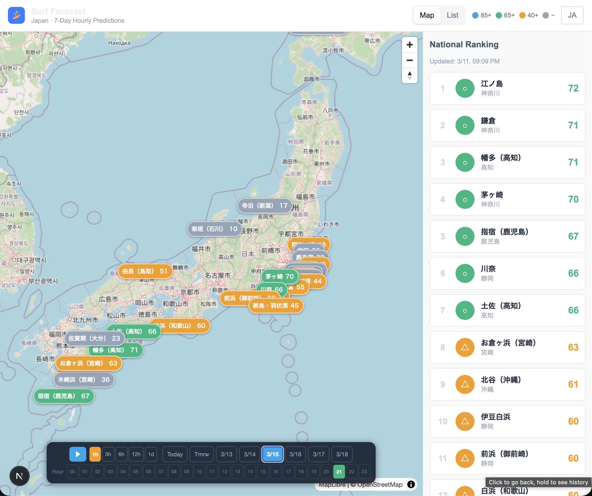

# Surf Forecast

Japan-wide surf score forecast app. 7-day hourly predictions for major surf spots across Japan.



## Features

- **National map view** — All spots plotted on an interactive map with color-coded scores
- **7-day hourly forecast** — Score predictions at 1-hour resolution for each spot
- **Animated playback** — Windy-style time animation with selectable step (1h / 3h / 6h / 12h / 1d)
- **National ranking** — Spots ranked by current score, updated in real time as you scrub the timeline
- **Spot detail** — Click any spot to see its daily score breakdown and link to hourly chart
- **Bilingual** — Japanese / English toggle

## Score Color Scheme

| Score | Color | Label |
|-------|-------|-------|
| 85–100 | `#0ea5e9` sky blue | ◎ Excellent |
| 65–84 | `#10b981` emerald | ○ Good |
| 40–64 | `#f59e0b` amber | △ Fair |
| 0–39 | `#94a3b8` slate | × Poor |

Score is computed from wave height, period, swell direction, wind, and tide — normalized to 0–100.

## Tech Stack

### Backend (Python)
- **Open-Meteo Marine API** — 7-day wave forecast (free, no API key)
- **ERA5 (ECMWF)** — 80+ years of historical wave data for ML training
- **LightGBM + Optuna** — Surf score prediction model
- **SQLite** — Lightweight local data store

### Frontend (Next.js)
- **Next.js 14** + TypeScript + Tailwind CSS
- **MapLibre GL** — Interactive map
- **Recharts** — Score charts
- **next-intl** — i18n (ja/en)

## Project Structure

```
surf-forecast/
├── data/
│   └── spots.json              # Spot definitions (lat/lon/orientation/etc.)
├── src/
│   ├── db/models.py            # SQLite schema
│   ├── ingestion/
│   │   ├── apis/
│   │   │   ├── era5.py         # ERA5 historical wave data
│   │   │   ├── open_meteo.py   # Forecast data
│   │   │   ├── jma_tide.py     # JMA tide data
│   │   │   └── moon_phase.py   # Moon phase calculation
│   │   └── scrapers/
│   │       └── bcm.py          # BCM scraper
│   ├── processing/
│   │   ├── score_formula.py    # Rule-based score (for initial labels)
│   │   └── features.py         # Feature engineering
│   └── models/train.py         # LightGBM + Optuna
├── scripts/
│   ├── backfill_era5.py        # One-time ERA5 historical backfill
│   ├── generate_formula_labels.py
│   ├── daily_update.py         # Daily ETL
│   └── generate_predictions.py # Write predictions.json
├── web/                        # Next.js frontend
│   └── public/data/
│       └── predictions.json    # Generated forecast data
├── blog/
│   └── vibe-coding-surf-forecast.md  # Blog post about this project
└── docs/
    └── screenshot.png
```

## Setup

```bash
pip install -r requirements.txt

# Initialize DB
python -m src.db.models

# (Optional) Backfill ERA5 historical data for ML training
# Requires free account at https://cds.climate.copernicus.eu/
python scripts/backfill_era5.py --start-year 2010 --end-year 2024
python scripts/generate_formula_labels.py
python -m src.models.train

# Generate forecast JSON (uses Open-Meteo, no API key needed)
python scripts/generate_predictions.py

# Run frontend
cd web && npm install && npm run dev
```

## Blog

Made entirely with [Claude Code](https://claude.ai/claude-code) (vibe-coding).
Write-up: [blog/vibe-coding-surf-forecast.md](blog/vibe-coding-surf-forecast.md)
